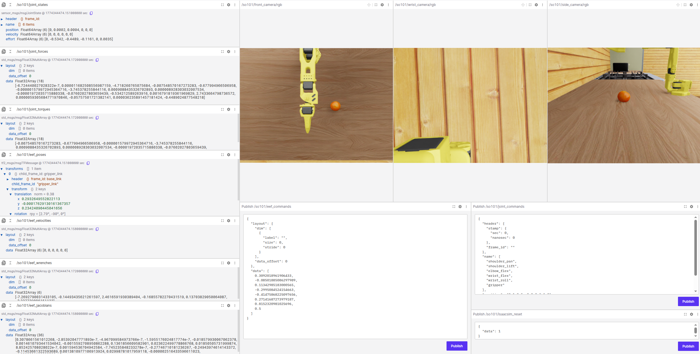

# IsaacSim-Hil-Serl

## Part 1: 熟悉项目细节

### 💡 Code Structure

以下给出了整个项目的代码目录：

|Code Directory | Description |
| :-------: | :---------: |
| examples 	| Scripts for policy training, demonstration data collection, reward classifier training |
| serl_launcher| Main code for IsaacSim-HIL-SERL |
| serl_launcher.agents | Agent Policies (e.g. SAC) |
| serl_launcher.wrappers | Gym env wrappers |
| serl_launcher.data | Replay buffer and data store |
| serl_launcher.vision | Vision related models and utils |
| robot_infra | Robot infra for running with real and simulated robots |
| robot_infra.robot_servers | Flask server for sending commands to robot via ROS2 |
| robot_infra.gym_env |	Gym env for robot |
| robot_infra.isaacsim_venvs | IsaacSim env for robot |

### 📋 项目运行环境

- 建议安装 Foxglove Studio, uv。

- 运行环境 Ubantu 22.04, CUDA 12.8, Python 3.11。

### 🚀 安装基础框架

```Bash
git clone https://github.com/Incalos/IsaacSim-Hil-Serl
cd IsaacSim-Hil-Serl

# 安装基础 python 环境
uv venv --python=3.11
source .venv/bin/activate
uv pip install --upgrade pip
sudo apt install cmake build-essential

# 安装 PyTorch
uv pip install -U torch==2.7.0 torchvision==0.22.0 --index-url https://download.pytorch.org/whl/cu128

# 安装 Isaac Sim 5.1 
uv pip install "isaacsim[all,extscache]==5.1.0" --extra-index-url https://pypi.nvidia.com

# 在 dependencies/ 下安装主要依赖
cd dependencies/

# 在 dependencies/ 下安装 Isaac Lab
git clone git@github.com:isaac-sim/IsaacLab.git
cd IsaacLab/
./isaaclab.sh --install

# 在 dependencies/ 下安装 LeIsaac
git clone https://github.com/LightwheelAI/leisaac.git
cd leisaac/
uv pip install -e source/leisaac

# 在 dependencies/ 下安装 LeRobot
git clone https://github.com/huggingface/lerobot.git
cd lerobot
uv pip install -e .

# 在 dependencies/ 下安装 cuRobo
git clone --branch v0.7.7 --depth 1 https://github.com/NVlabs/curobo.git
cd curobo
uv pip install -e . --no-build-isolation

# 在 dependencies/ 下安装 agentlace
git clone https://github.com/youliangtan/agentlace.git
cd agentlace/
uv pip install -e .
```

## Part 2: SO101-PickOranges 任务的 Real world RL

Part 2 详细介绍如何在 IsaacSim 仿真环境中配置并训练 SO101 机械臂的 Real World RL。注意，此处的 Real World RL 是伪真机 RL，由 IsaacSim 模拟真机。

### 📦 IsaacSim 资产准备

Part 2 以开源的 SO101-PickOranges 任务为例，需要[下载 USD 资源](https://github.com/LightwheelAI/leisaac/releases/tag/v0.1.0)并配置场景文件。

解压下载好的压缩包，并将资产放置在 `robot_infra/isaacsim_venvs/assets` 文件夹中. 

`assets` 文件夹的结构如下:

```
<assets>
├── robots/
│   └── so101_follower.usd
└── scenes/
    └── kitchen_with_orange/
        ├── scene.usd
        ├── assets
        └── objects/
            ├── Orange001
            ├── Orange002
            ├── Orange003
            └── Plate
```

### 🤖 熟悉 Isaac Sim 环境

Part 2 将 Isaac Sim 视作“数字孪生”层面的 Real World 代理，旨在为 SO101 机械臂提供高保真度的物理模拟与实时控制接口。

针对 SO101 机械臂，我们提供了 cartesian pose control 以及 joint position control 两种控制模式。为提升 Real World RL 的鲁棒性，我们为该环境增加了 Domain randomization 策略，按下键盘的 `R` 键即可重置该环境。

机械臂在仿真过程中的物理状态（包括关节力矩、末端位姿、相机流等）均通过 ROS2 实时发布，确保算法获取的数据与真实世界物理规律高度一致。我们推荐使用 Foxglove Studio 进行可视化调试，实时监控 ROS2 话题并下发控制指令。

```Bash
cd IsaacSim-Hil-Serl/examples/experiments/so101_pick_oranges
bash ./1_start_isaacsim_venv.sh
# Open in a new terminal
bash ./2_foxglove_inspect_data.sh
```



除了使用 Foxglove Studio 实时监控 ROS2 话题并下发控制指令外，参考 [Hil-Serl](https://github.com/rail-berkeley/hil-serl/blob/main/serl_robot_infra/README.md)，我们还提供 Flask Server 与 ROS2 进行通讯。

首先，需在 ROS2 的工作空间内编译 Flask Server。

```Bash
cd IsaacSim-Hil-Serl/robot_infra/robot_servers
colcon build
```

之后，依次启动 IsaacSim 环境、Falsk Server 节点。

```Bash
cd IsaacSim-Hil-Serl/examples/experiments/so101_pick_oranges
bash ./1_start_isaacsim_venv.sh
# Open in a new terminal
bash ./3_start_robot_server.sh
```

新开一个终端，输入以下指令，也可实现与 Foxglove Studio 相似的功能。

```Bash
while true; do curl -X POST http://127.0.0.1:5000/get_joint_positions; echo; done
while true; do curl -X POST http://127.0.0.1:5000/get_joint_velocities; echo; done
while true; do curl -X POST http://127.0.0.1:5000/get_joint_efforts; echo; done
while true; do curl -X POST http://127.0.0.1:5000/get_joint_forces; echo; done
while true; do curl -X POST http://127.0.0.1:5000/get_joint_torques; echo; done
while true; do curl -X POST http://127.0.0.1:5000/get_eef_poses_quat; echo; done
while true; do curl -X POST http://127.0.0.1:5000/get_eef_poses_euler; echo; done
while true; do curl -X POST http://127.0.0.1:5000/get_eef_forces; echo; done
while true; do curl -X POST http://127.0.0.1:5000/get_eef_torques; echo; done
while true; do curl -X POST http://127.0.0.1:5000/get_eef_velocities; echo; done
while true; do curl -X POST http://127.0.0.1:5000/get_eef_jacobians; echo; done
while true; do curl -X POST http://127.0.0.1:5000/get_state; echo; done
while true; do curl -X POST http://127.0.0.1:5000/get_config; echo; done
# Robot 恢复初始位姿
curl -X POST http://127.0.0.1:5000/reset_robot
# Joints 以 position 的格式发布
curl -X POST http://127.0.0.1:5000/move_joints -H "Content-Type: application/json" -d '{"joint_pose":[0.1,0.2,0.3,0.4,0.5,0.6]}'
# EEF 以 position + rpy 格式发布
curl -X POST http://127.0.0.1:5000/move_eef -H "Content-Type: application/json" -d '{"eef_pose":[0.02,-0.23,0.18,21.24,-0.00,-180], "gripper_state":0.1}'
# EEF 以 position + quaternion (x,y,z,w)格式发布
curl -X POST http://127.0.0.1:5000/move_eef -H "Content-Type: application/json" -d '{"eef_pose":[-0.16,-0.14,0.2,0.2,0.2,0.2,0.2], "gripper_state":0.1}'
```

### 🛠️ 运行 HIL-SERL

##### Step 1. 定义工作空间

为避免强化学习随机探索的过程中发生机器人碰撞等危险情况，在训练开始之前，需根据任务特性确定其工作空间。

```Bash
cd IsaacSim-Hil-Serl/examples/experiments/so101_pick_oranges
bash ./1_start_isaacsim_venv.sh
# Open in a new terminal
bash ./3_start_robot_server.sh
# Open in a new terminal
bash ./4_check_robot_workspace.sh
```

操作说明：

- 配置文件：程序会实时将工作空间参数保存进 ROS2 参数服务器的配置文件 `robot_infra/robot_servers/src/so101_interfaces/config/so101_params.yaml` 中。

- IsaacSim 控制方式：按下键盘上的 `r` 键将重置环境。

- 机械臂控制方式：此处仅提供 Gamepad 的控制方式。

| 控制按键    | 描述 |
| :-------: | :---------: |
| move `L` forward / backward | 控制末端的前后平移 |
| move `L` left / right | 控制 `shoulder_pan` 关节，机械臂的左右摆动 |
| move `R` forward / backward | 控制 `wrist_flex` 关节，末端的上下俯仰 |
| move `R` left / right | 控制 `wrist_roll` 关节，末端的旋转 |
| press `LB` / `LT` | 控制末端的上下平移 |
| press `RB` / `RT` | 控制 `grasp` 关节，末端夹爪的开合 |

工作空间定义好后，需重新编译 Flask Server，以将最新参数传入参数服务器中。

```Bash
cd IsaacSim-Hil-Serl/robot_infra/robot_servers
colcon build
```

##### Step 2. 训练 Reward Classifier

Part 2 通过 Gamepad 遥操机械臂以及人工标注关键帧，收集用于奖励函数训练的样本。样本存放于 `examples/experiments/so101_pick_oranges/classifier_data` 文件夹中。

```Bash
cd IsaacSim-Hil-Serl/examples/experiments/so101_pick_oranges
bash ./1_start_isaacsim_venv.sh
# Open in a new terminal
bash ./3_start_robot_server.sh
# Open in a new terminal
bash ./5_record_classifier_data.sh
```

操作说明：

- 机械臂控制方式：参考 [4.1 定义工作空间](#41-定义工作空间)。

- 样本标注方式：

    - 按下 `b` 键开启该 episode 的样本记录。
    
    - 按下 `space` 键将当前尝试标记为`成功 (Successful)`并终止该 episode，机器人将恢复初始位姿。
    
    - 当超过 episode 的最大步骤，当前尝试会自动终止并重置机器人位姿。

- IsaacSim 控制方式：按下键盘上的 `r` 键将重置环境，建议在机器人重置位姿或者任务发生异常时按键。

样本采集完后，运行如下命令训练 Reward Classifier，权重保存在 `examples/experiments/so101_pick_oranges/classifier_ckpt` 文件夹中。

```Bash
# Open in a new terminal
bash ./6_train_reward_classifier.sh
```

##### Step 3. 收集 Demo

Hil-Serl 在训练之前需要根据之前训练好的 Reward Classifier 采集一批成功的 demo，具体按照如下方式。此处依然使用 Gamepad 进行遥操。

采集好的 demo 存放于 `examples/experiments/so101_pick_oranges/demo_data` 文件夹中。

```Bash
cd IsaacSim-Hil-Serl/examples/experiments/so101_pick_oranges
bash ./1_start_isaacsim_venv.sh
# Open in a new terminal
bash ./3_start_robot_server.sh
# Open in a new terminal
bash ./7_record_demos.sh
```