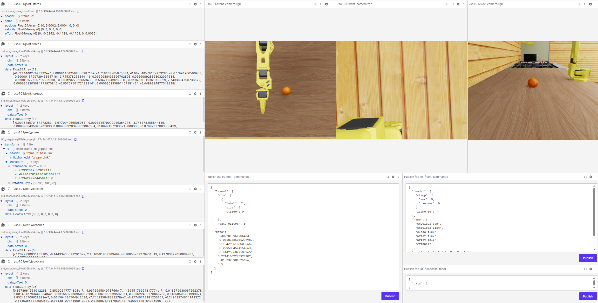

# IsaacSim-Hil-Serl

基于 Isaac Sim 的混合真机强化学习（HIL-SERL）框架，旨在高保真仿真与真实机器人之间构建统一的现实世界强化学习（Real-World RL）训练闭环。

## Part 1: 项目准备

### 📁 代码结构

IsaacSim-Hil-Serl 项目的主要代码结构如下所示：

<center>

| 目录 | 说明 |
| :-------: | :---------: |
| `examples` | 工作空间标定、示范数据采集、奖励分类器训练及策略训练相关程序脚本 |
| `serl_launcher` | IsaacSim-HIL-SERL 框架核心启动逻辑与训练流程实现代码 |
| `serl_launcher.agents` | 强化学习智能体策略模块（如 SAC 算法）的具体实现 |
| `serl_launcher.wrappers` | 面向 Gym 环境的封装与适配工具模块 |
| `serl_launcher.data` | 经验回放缓冲区与数据存储管理模块 |
| `serl_launcher.vision` | 视觉感知相关模型定义与工具函数实现 |
| `robot_infra` | 支撑仿真 / 真实机器人运行的基础设施核心代码 |
| `robot_infra.robot_servers` | 基于 ROS2 与机器人交互的 Flask 服务端实现 |
| `robot_infra.gym_env` | 机器人任务相关的 Gym 标准化环境定义 |
| `robot_infra.isaacsim_venvs` | 基于 Isaac Sim 的机器人仿真环境配置与初始化模块 |

</center>

### 💻 项目运行环境

- **Ubuntu 22.04**
- **CUDA 12.8**
- **Python 3.11**

### 📦 安装基础依赖

```Bash
git clone https://github.com/Incalos/IsaacSim-Hil-Serl
cd IsaacSim-Hil-Serl

# 安装 Foxglove，参考 https://foxglove.dev/download

# 安装 uv，参考 https://docs.astral.sh/uv/getting-started/installation/

# 安装基础 python 环境
uv venv --python=3.11
source .venv/bin/activate
uv pip install --upgrade pip
sudo apt update && sudo apt install -y xvfb x11-utils
sudo apt install cmake build-essential

# 安装 PyTorch
uv pip install -U torch==2.7.0 torchvision==0.22.0 --index-url https://download.pytorch.org/whl/cu128

# 安装 Isaac Sim 5.1 
uv pip install "isaacsim[all,extscache]==5.1.0" --extra-index-url https://pypi.nvidia.com

# 在 dependencies/ 下安装主要依赖
cd dependencies/

# 在 dependencies/ 下安装 Isaac Lab
git clone https://github.com/isaac-sim/IsaacLab.git
cd IsaacLab/
./isaaclab.sh --install

# 在 dependencies/ 下安装 LeIsaac
git clone https://github.com/LightwheelAI/leisaac.git
cd leisaac/
uv pip install -e source/leisaac

# 在 dependencies/ 下安装 LeRobot
git clone https://github.com/huggingface/lerobot.git
cd lerobot
uv pip install -e .

# 在 dependencies/ 下安装 cuRobo
git clone --branch v0.7.7 --depth 1 https://github.com/NVlabs/curobo.git
cd curobo
uv pip install -e . --no-build-isolation

# 在 dependencies/ 下安装 agentlace
git clone https://github.com/youliangtan/agentlace.git
cd agentlace/
uv pip install -e .
```

## Part 2: SO101-ReachOrange 任务的 Real-World RL

本章节详细介绍在 Isaac Sim 仿真环境中，对 SO101 机械臂进行真实世界强化学习（Real-World RL）的配置与训练流程。

需要特别说明的是，此处的 Real-World RL 采用“伪真机” 仿真设置：通过 Isaac Sim 高保真还原真实机器人环境，在不直接操作实体硬件的前提下，完成策略训练与验证。

### 🧩 Isaac Sim 资产准备

在开展 SO101 机械臂 Real-World RL 训练前，需先[下载 USD 资源](https://github.com/LightwheelAI/leisaac/releases/tag/v0.1.0)，并完成仿真场景文件的配置。

解压已下载的压缩包，并将其中的资产文件放置到 `robot_infra/isaacsim_venvs/assets` 目录下。

`assets` 文件夹的目录结构要求如下：

```shell
<assets>
├── robots/
│   └── so101_follower.usd
└── scenes/
    └── kitchen_with_orange/
        ├── scene.usd
        ├── assets/
        └── objects/
```

### 🤖 熟悉 Isaac Sim 环境

Isaac Sim 作为 “数字孪生” 层面的真实世界代理，为 SO101 机械臂提供高保真物理模拟能力与实时控制接口。

针对 SO101 机械臂，我们提供**笛卡尔位姿控制（cartesian pose control）**和**关节位置控制（joint position control）**两种控制模式；为提升 Real-World RL 策略的鲁棒性，仿真环境中集成了域随机化（domain randomization）策略，按下键盘 **R** 键可快速重置环境。

机械臂仿真过程中的核心物理状态（关节力矩、末端位姿、相机图像流等）均通过 ROS2 实时发布，确保算法数据与真实物理规律高度一致。推荐使用 Foxglove Studio 进行可视化调试，以实时监控 ROS2 话题并下发控制指令。

```Bash
cd IsaacSim-Hil-Serl/examples/experiments/so101_reach_orange
bash ./1_start_isaacsim_venv.sh
# 新开终端执行以下命令
bash ./2_foxglove_inspect_data.sh
```



除了使用 Foxglove Studio 实时监控 ROS2 话题并下发控制指令外，我们还参考 [Hil-Serl](https://github.com/rail-berkeley/hil-serl/blob/main/serl_robot_infra/README.md 提供了基于 Flask Server 的 ROS2 通讯方式，具体操作步骤如下：

1.编译 Flask Server

进入 ROS2 工作空间，编译 Flask Server 相关代码：

```Bash
cd IsaacSim-Hil-Serl/robot_infra/robot_servers
colcon build
```

2.启动仿真环境与服务节点

依次启动 Isaac Sim 仿真环境和 Flask Server 节点：

```Bash
cd IsaacSim-Hil-Serl/examples/experiments/so101_reach_orange
bash ./1_start_isaacsim_venv.sh
# 新开终端执行
bash ./3_start_robot_server.sh
```

3.实现监控与交互

新开终端并执行对应指令，即可实现与 Foxglove Studio 功能相似的 ROS2 话题监控和交互操作。

```Bash
while true; do curl -X POST http://127.0.0.1:5000/get_joint_positions; echo; done
while true; do curl -X POST http://127.0.0.1:5000/get_joint_velocities; echo; done
while true; do curl -X POST http://127.0.0.1:5000/get_joint_efforts; echo; done
while true; do curl -X POST http://127.0.0.1:5000/get_joint_forces; echo; done
while true; do curl -X POST http://127.0.0.1:5000/get_joint_torques; echo; done
while true; do curl -X POST http://127.0.0.1:5000/get_eef_poses_quat; echo; done
while true; do curl -X POST http://127.0.0.1:5000/get_eef_poses_euler; echo; done
while true; do curl -X POST http://127.0.0.1:5000/get_eef_forces; echo; done
while true; do curl -X POST http://127.0.0.1:5000/get_eef_torques; echo; done
while true; do curl -X POST http://127.0.0.1:5000/get_eef_velocities; echo; done
while true; do curl -X POST http://127.0.0.1:5000/get_eef_jacobians; echo; done
while true; do curl -X POST http://127.0.0.1:5000/get_state; echo; done
while true; do curl -X POST http://127.0.0.1:5000/get_config; echo; done
# Robot 恢复初始位姿并重置 Isaac Sim 环境
curl -X POST http://127.0.0.1:5000/reset_robot
# Joints 以 position 的格式发布
curl -X POST http://127.0.0.1:5000/move_joints -H "Content-Type: application/json" -d '{"joint_pose":[0,0,0.2,1.0,-1.5708,0.5]}'
# EEF 以 position + rpy 格式发布
curl -X POST http://127.0.0.1:5000/move_eef -H "Content-Type: application/json" -d '{"eef_pose":[0.02,-0.23,0.18,21.24,-0.00,-180], "gripper_state":0.1}'
# EEF 以 position + quaternion (x,y,z,w)格式发布
curl -X POST http://127.0.0.1:5000/move_eef -H "Content-Type: application/json" -d '{"eef_pose":[-0.16,-0.14,0.2,0.2,0.2,0.2,0.2], "gripper_state":0.1}'
```

### 🛠️ 运行 HIL-SERL

#### Step 1. 定义工作空间

为避免强化学习随机探索阶段机械臂发生碰撞等风险，训练前需根据任务特性预先定义机器人的工作空间：

```Bash
cd IsaacSim-Hil-Serl/examples/experiments/so101_reach_orange
bash ./1_start_isaacsim_venv.sh
# 新开终端执行
bash ./3_start_robot_server.sh
# 新开终端执行
bash ./4_check_robot_workspace.sh
```

**操作说明**：

- 配置文件：工作空间参数会实时保存至本任务目录下的配置文件中 `examples/experiments/so101_reach_orange/so101_params.yaml`；

- Isaac Sim 控制：按下键盘 **r** 键可重置仿真环境；

- 机械臂控制：仅支持 Gamepad 手柄控制，按键映射如下：

<center>

| 控制按键 | 描述 |
| :-------: | :---------: |
| 左摇杆（L）前后移动 | 控制机械臂末端前后平移 |
| 左摇杆（L）左右移动 | 控制 `shoulder_pan` 关节（左右摆动） |
| 右摇杆（R）前后移动 | 控制 `wrist_flex` 关节（末端上下俯仰） |
| 右摇杆（R）左右移动 | 控制 `wrist_roll` 关节（末端旋转） |
| 按下 LB / LT 键 | 控制机械臂末端上下平移 |
| 按下 RB / RT 键 | 控制 `grasp` 关节（夹爪开合） |

</center>

#### Step 2. 训练奖励分类器（Reward Classifier）

本步骤通过 Gamepad 遥操作机械臂并人工标注关键帧，收集奖励函数训练样本（样本存放于 `examples/experiments/so101_reach_orange/classifier_data/`）：

```Bash
cd IsaacSim-Hil-Serl/examples/experiments/so101_reach_orange
bash ./1_start_isaacsim_venv.sh
# 新开终端执行
bash ./3_start_robot_server.sh
# 新开终端执行
bash ./5_record_classifier_data.sh
```

**操作说明**：

- 机械臂控制：参考 [定义工作空间](#step-1-定义工作空间)。

- 样本标注：

  - 启动记录：按下 `b` 键开始记录当前回合的样本数据；

  - 手动标记成功：按下 `space` 键可将当前操作标记为 “成功”，系统会立即终止该回合，机器人自动回到初始位姿，同时 Isaac Sim 仿真环境完成重置；

  - 自动终止重置：若操作步骤超过单回合最大步骤，当前尝试会自动终止，机器人位姿和 Isaac Sim 仿真环境均会自动重置至初始状态。

- Isaac Sim 控制：按下 `r` 键重置环境（建议在机器人复位或任务异常时使用）。

样本采集完成后，执行以下命令训练奖励分类器（权重保存至 `examples/experiments/so101_reach_orange/classifier_ckpt/`）：

```Bash
# 新开终端执行以下命令
bash ./6_train_reward_classifier.sh
```

#### Step 3. 收集演示数据（Demo）

正式训练前，Hil-Serl 需基于已训练的奖励分类器采集一批成功的演示数据（Demo），仍通过 Gamepad 遥操作完成：

```Bash
cd IsaacSim-Hil-Serl/examples/experiments/so101_reach_orange
bash ./1_start_isaacsim_venv.sh
# 新开终端执行
bash ./3_start_robot_server.sh
# 新开终端执行
bash ./7_record_demos.sh
```

操作说明：

- 机械臂控制：参考 [定义工作空间](#step-1-定义工作空间)。

- Demo 收集方式：

  - 启动记录：按下 `b` 键启动当前回合记录，奖励分类器会自动判定操作是否成功，成功则自动终止回合并开启新记录；

  - 自动终止重置：若操作步骤超过单回合最大步骤，当前尝试会自动终止，机器人位姿和 Isaac Sim 仿真环境均会自动重置至初始状态。

采集的 Demo 存放于 `examples/experiments/so101_reach_orange/demo_data/`，可通过以下命令回放验证数据有效性：

```Bash
# 新开终端执行以下命令
bash ./8_replay_demos.sh
```

#### Step 4. Real-World RL 的训练

参考 [Hil-Serl](https://github.com/rail-berkeley/hil-serl) 训练范式，训练前期需更多人工介入引导机械臂完成任务，随策略性能提升逐步减少干预：

```Bash
cd IsaacSim-Hil-Serl/examples/experiments/so101_reach_orange
bash ./1_start_isaacsim_venv.sh
# 新开终端执行以下命令
bash ./3_start_robot_server.sh
# 新开终端执行以下命令
bash ./run_learner.sh
# 新开终端执行以下命令
bash ./run_actor.sh
```

操作说明：

- 机械臂控制：参考 [定义工作空间](#step-1-定义工作空间)。

#### Step 5. Real-World RL 的验证

在完成 Real-World RL 训练后，可通过该步骤加载训练好的策略，在 Isaac Sim 高保真仿真环境中对 SO101 机械臂进行任务性能验证。

此环节可直接评估策略在接近真实物理条件下的完成效果、运动稳定性与泛化能力，为后续从仿真迁移到实体机器人提供可信的验证结果。

```Bash
cd IsaacSim-Hil-Serl/examples/experiments/so101_reach_orange
bash ./1_start_isaacsim_venv.sh
# 新开终端执行以下命令
bash ./3_start_robot_server.sh
# 新开终端执行以下命令
bash ./9_val_actor.sh
```
