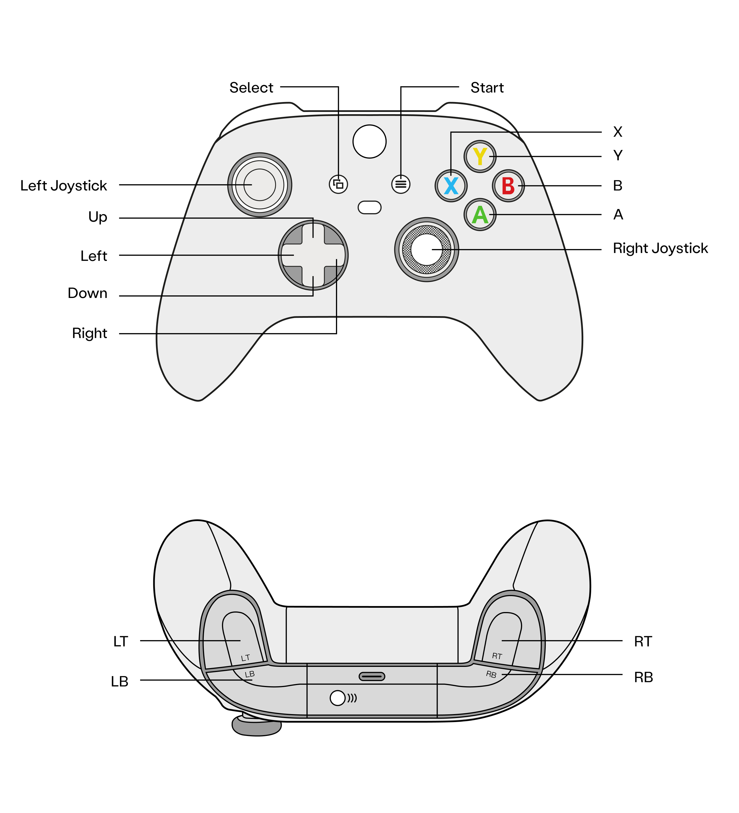

# IsaacSim-Hil-Serl

> **中文文档**: README_CN.md | **English Documentation**: [README.md](./README.md)

本方案采用 UC Berkeley RAIL 实验室的 [HIL-SERL](https://github.com/rail-berkeley/hil-serl) 框架，创新性地引入 NVIDIA Isaac Sim 作为策略可行性的“预验证平台”。通过在仿真环境中确认策略有效性，大幅降低真机强化学习（Real-World RL）的试错风险，进而直接在真实机器人上执行高效的强化学习训练，实现从虚拟验证到现实落地的无缝衔接。

## Part 1: 项目准备

### 📁 代码结构

IsaacSim-Hil-Serl 项目的代码结构如下所示：

| 目录 | 说明 |
| :-------: | :---------: |
| `dependencies` | 项目运行的本地依赖库 |
| `examples` | 工作空间标定、示范数据采集、奖励分类器训练及策略训练相关程序脚本 |
| `robot_infra` | 支撑仿真 / 真实机器人运行的基础设施核心代码 |
| `robot_infra.gym_env` | 机器人任务相关的 Gym 标准化环境定义 |
| `robot_infra.isaacsim_venvs` | 基于 IsaacSim 的机器人仿真环境配置与初始化模块 |
| `robot_infra.robot_servers` | 基于 ROS2 与机器人交互的 Flask 服务端实现 |
| `serl_launcher` | 基础运行逻辑和通用库，是连接各个模块的枢纽 |
| `serl_launcher.agents` | 强化学习智能体策略模块的具体实现 |
| `serl_launcher.common` | 存放整个框架共享的基础模块 |
| `serl_launcher.data` | 经验回放缓冲区与数据存储管理模块 |
| `serl_launcher.networks` | 定义深度学习中使用的具体网络层和架构 |
| `serl_launcher.utils` | 包含各种辅助性脚本和工具函数 |
| `serl_launcher.vision` | 视觉感知相关模型定义与工具函数实现 |
| `serl_launcher.wrappers` | 面向 Gym 环境的封装与适配工具模块 |

### 💻 项目运行环境

- **Ubuntu 22.04**
- **CUDA 12.8**
- **Python 3.11**

### 📦 安装项目依赖

```Bash
git clone https://github.com/Incalos/IsaacSim-Hil-Serl
cd IsaacSim-Hil-Serl

# 安装基础依赖
sudo apt update && sudo apt install -y \
    xvfb \
    x11-utils \
    cmake \
    build-essential \
    coinor-libipopt-dev \
    gfortran \
    liblapack-dev \
    pkg-config \
    swig \
    git \
    python3 \
    python3-pip \
    git-lfs \
    foxglove-studio \
    --install-recommends
  
# 安装 uv 与基础 python 环境
pip install uv --user
uv venv --python=3.11
source .venv/bin/activate
uv pip install ml_collections

# 安装 PyTorch
uv pip install -U torch==2.7.0 torchvision==0.22.0 --index-url https://download.pytorch.org/whl/cu128

# 安装 IsaacSim 5.1 
uv pip install "isaacsim[all,extscache]==5.1.0" --extra-index-url https://pypi.nvidia.com

# 在 dependencies/ 下安装 Isaac Lab
cd dependencies/ && \
git clone https://github.com/isaac-sim/IsaacLab.git && \
cd IsaacLab/ && \
./isaaclab.sh --install

# 在 dependencies/ 下安装 LeIsaac
cd dependencies/ && \
git clone --branch v0.3.0 --depth 1 https://github.com/LightwheelAI/leisaac.git && \
cd leisaac/ && \
uv pip install -e source/leisaac

# 在 dependencies/ 下安装 LeRobot
cd dependencies/ && \
git clone --branch v0.4.3 --depth 1 https://github.com/huggingface/lerobot.git && \
cd lerobot && \
uv pip install -e .

# 在 dependencies/ 下安装 cuRobo
cd dependencies/ && \
git clone --branch v0.7.7 --depth 1 https://github.com/NVlabs/curobo.git && \
cd curobo && \
uv pip install -e . --no-build-isolation

# 在 dependencies/ 下安装 agentlace
cd dependencies/ && \
git clone https://github.com/youliangtan/agentlace.git && \
cd agentlace/ && \
uv pip install -e .
```

## Part 2: SO101-Grasp-Orange 任务的 Real-World RL 实现

本章节将系统阐述在 IsaacSim 仿真环境下，面向 SO101 机械臂执行 SO101-Grasp-Orange 任务的 Real-World RL 全流程配置方案与训练实施范式。

需要特别说明的是，本章所采用的 Real-World RL 方案依托仿真实现落地：借助 IsaacSim 对真实机器人物理场景进行高保真复刻，在不直接操控实体硬件的前提下，完成智能策略的迭代训练与有效性验证。

### 🧩 准备 IsaacSim 资产

在启动 SO101 机械臂 Real-World RL 训练流程之前，需先行[下载 USD 资源](https://github.com/LightwheelAI/leisaac/releases/download/v0.1.0/kitchen_with_orange.zip)，并完成仿真场景的部署与配置工作。

将下载完成的压缩包进行解压，并将解压后的全部资产文件统一放置至  `robot_infra/isaacsim_venvs/tasks/scenes` 目录下，完成仿真资源的路径部署。

`scenes` 文件夹的目录结构要求如下：

```shell
tasks/
├── robots/
└── scenes/
    └── kitchen_with_orange/
        ├── scene.usd
        ├── assets/
        └── objects/
```

进入 `robot_infra/isaacsim_venvs/tasks/scenes/kitchen_with_orange/objects` 目录，移除该目录下的 `Orange002`、`Orange003` 及 `Plate` 三项冗余资产。

### 🤖 熟悉 IsaacSim 环境

作为数字孪生维度的真实世界代理，IsaacSim 为 SO101 机械臂提供了高保真物理仿真能力与低延迟实时控制接口。

针对 SO101 机械臂，本方案支持 **笛卡尔位姿控制（cartesian pose control）** 和 **关节位置控制（joint position control）** 两种控制模式；为提升 Real-World RL 策略的鲁棒性，仿真环境中集成了 **域随机化（domain randomization）** 策略，按下键盘 **R** 键可快速重置环境。

仿真运行期间，机械臂关节力矩、末端执行器位姿、视觉相机图像流等核心物理状态将通过 ROS2 实时发布，保障算法观测数据与真实物理规律高度对齐。推荐使用 Foxglove Studio 完成可视化调试，实现 ROS2 话题实时监控与控制指令精准下发。

```Bash
cd examples/experiments/so101_grasp_orange
bash ./1_start_isaacsim_venv.sh
# 新开终端执行以下命令
bash ./2_foxglove_inspect_data.sh
```

Foxglove Studio 启动后，可以将 `examples/experiments/so101_grasp_orange/foxglove_layout.json` 布局文件导入其中，以快速加载预设的可视化面板。


除了使用 Foxglove Studio 实时监控 ROS2 话题并下发控制指令外，我们还提供基于 Flask Server 的 ROS2 通讯方式，具体操作步骤如下：

1.编译 Flask Server

进入 ROS2 工作空间，编译 Flask Server 相关代码：

```Bash
cd robot_infra/robot_servers
colcon build
```

2.启动仿真环境与服务节点

按照顺序，先启动 IsaacSim 仿真环境，随后启动 Flask Server 节点：

```Bash
cd examples/experiments/so101_grasp_orange
bash ./1_start_isaacsim_venv.sh
# 新开终端执行
bash ./3_start_robot_server.sh
```

3.实现监控与交互

打开新的终端窗口并执行相应指令，即可实现与 Foxglove Studio 类似的 ROS2 话题监控及交互功能。

```Bash
while true; do curl -X POST http://127.0.0.1:5000/get_joint_positions; echo; done
while true; do curl -X POST http://127.0.0.1:5000/get_joint_efforts; echo; done
while true; do curl -X POST http://127.0.0.1:5000/get_joint_forces; echo; done
while true; do curl -X POST http://127.0.0.1:5000/get_joint_torques; echo; done
while true; do curl -X POST http://127.0.0.1:5000/get_eef_poses_quat; echo; done
while true; do curl -X POST http://127.0.0.1:5000/get_eef_poses_euler; echo; done
while true; do curl -X POST http://127.0.0.1:5000/get_eef_forces; echo; done
while true; do curl -X POST http://127.0.0.1:5000/get_eef_torques; echo; done
while true; do curl -X POST http://127.0.0.1:5000/get_eef_velocities; echo; done
while true; do curl -X POST http://127.0.0.1:5000/get_eef_jacobians; echo; done
while true; do curl -X POST http://127.0.0.1:5000/get_state; echo; done
# Robot 恢复初始位姿并重置 IsaacSim 环境
curl -X POST http://127.0.0.1:5000/reset_robot
# 重置 IsaacSim 环境
curl -X POST http://127.0.0.1:5000/reset_isaacsim
# Joints 以 position 的格式发布
curl -X POST http://127.0.0.1:5000/move_joints -H "Content-Type: application/json" -d '{"joint_pose":[0.5,0.1,-0.4,0.2,1.2,0.7]}'
# EEF 以 position + rpy 格式发布
curl -X POST http://127.0.0.1:5000/move_eef -H "Content-Type: application/json" -d '{"eef_pose":[0.27138811349868774,-0.0001829345856094733,0.21648338437080383,0.7695847901163139,0.030466061901383457,-1.6022399150116016], "gripper_state":0.5}'
# EEF 以 position + quaternion (x,y,z,w)格式发布
curl -X POST http://127.0.0.1:5000/move_eef -H "Content-Type: application/json" -d '{"eef_pose":[0.2988014817237854,-0.05197674408555031,0.18513618409633636,-0.6495405435562134,-0.5627134442329407,0.3135982155799866,0.4038655161857605]
, "gripper_state":1.0}'
```

### 🕹️ 遥操 SO101 机械臂

若计划使用 Xbox 手柄进行 SO101 机械臂的遥操作，请务必先连接好手柄。为了排除其他设备的潜在干扰，需要获取该手柄的唯一标识（GUID），并填写进 `examples/experiments/so101_grasp_orange/exp_params.yaml` 配置文件中。请保持设备连接状态，并执行以下指令进行查询：

```Bash
python3 -c "import os; os.environ['PYGAME_HIDE_SUPPORT_PROMPT']='1'; import pygame; pygame.init(); pygame.joystick.init(); [print(f'\nIndex: {i}\nName: {j.get_name()}\nGUID: {j.get_guid()}\n' + '-'*20) or j.init() for i in range(pygame.joystick.get_count()) for j in [pygame.joystick.Joystick(i)]]; pygame.quit()"
```

Xbox 手柄按键对应机械臂操作的映射关系如下表所示，按键示意图见下方：

<div style="display: flex; flex-wrap: wrap; align-items: center; justify-content: center; gap: 2rem; max-width: 100%;">
  <div style="flex: 1 1 450px; min-width: 300px;">
    <table style="width: 100%; border-collapse: collapse;">
      <tr>
        <th align="center" style="padding: 8px; border: 1px solid #ddd;">控制按键</th>
        <th align="center" style="padding: 8px; border: 1px solid #ddd;">描述</th>
      </tr>
      <tr>
        <td align="center" style="padding: 8px; border: 1px solid #ddd;">左摇杆（Left Joystick）前后移动</td>
        <td align="center" style="padding: 8px; border: 1px solid #ddd;">机械臂末端前后平移</td>
      </tr>
      <tr>
        <td align="center" style="padding: 8px; border: 1px solid #ddd;">左摇杆（Left Joystick）左右移动</td>
        <td align="center" style="padding: 8px; border: 1px solid #ddd;">控制 shoulder_pan 关节左右摆动</td>
      </tr>
      <tr>
        <td align="center" style="padding: 8px; border: 1px solid #ddd;">右摇杆（Right Joystick）前后移动</td>
        <td align="center" style="padding: 8px; border: 1px solid #ddd;">控制 wrist_flex 关节，末端上下俯仰</td>
      </tr>
      <tr>
        <td align="center" style="padding: 8px; border: 1px solid #ddd;">右摇杆（Right Joystick）左右移动</td>
        <td align="center" style="padding: 8px; border: 1px solid #ddd;">控制 wrist_roll 关节，末端旋转</td>
      </tr>
      <tr>
        <td align="center" style="padding: 8px; border: 1px solid #ddd;">按下 LB 键</td>
        <td align="center" style="padding: 8px; border: 1px solid #ddd;">控制机械臂末端向上平移</td>
      </tr>
      <tr>
        <td align="center" style="padding: 8px; border: 1px solid #ddd;">按下 LT 键</td>
        <td align="center" style="padding: 8px; border: 1px solid #ddd;">控制机械臂末端向下平移</td>
      </tr>
      <tr>
        <td align="center" style="padding: 8px; border: 1px solid #ddd;">按下 RB 键</td>
        <td align="center" style="padding: 8px; border: 1px solid #ddd;">控制 grasp 关节，夹爪打开</td>
      </tr>
      <tr>
        <td align="center" style="padding: 8px; border: 1px solid #ddd;">按下 RT 键</td>
        <td align="center" style="padding: 8px; border: 1px solid #ddd;">控制 grasp 关节，夹爪闭合</td>
      </tr>
    </table>
  </div>
  <div style="flex: 1 1 300px; min-width: 280px; text-align: center;">
    
  </div>
</div>

### 🛠️ 运行 Real-World RL

#### Step 1. 定义工作空间

为了有效规避强化学习随机探索阶段中机械臂可能发生的碰撞等安全风险，在开始训练之前，必须根据具体任务的特性预先精确设定机器人的工作空间范围。

这些关键的工作空间参数将在训练过程中被实时监控和调整，并最终自动保存至对应任务目录下的专用配置文件中：`examples/experiments/so101_grasp_orange/exp_params.yaml`。

```Bash
cd examples/experiments/so101_grasp_orange
bash ./1_start_isaacsim_venv.sh
# 新开终端执行
bash ./3_start_robot_server.sh
# 新开终端执行
bash ./4_check_robot_workspace.sh
```

**操作说明**：

- 机械臂控制：参考 [SO101 遥操作说明](#-so101-遥操作说明)。

- 工作空间定义：根据具体任务需求确定机械臂的合理运动范围。在正式训练开始前，务必全面验证机械臂在任务空间内的所有极限位置和姿态下均能避免碰撞，确保工作空间的安全性。

#### Step 2. 训练奖励分类器

本步骤需要通过 Xbox 手柄遥操作机械臂执行任务，并对采集视频中的关键帧进行人工标注，从而收集用于训练奖励函数的样本数据。这些样本将自动存放在指定目录中： `examples/experiments/so101_grasp_orange/classifier_data/`。

```Bash
cd examples/experiments/so101_grasp_orange
bash ./1_start_isaacsim_venv.sh
# 新开终端执行
bash ./3_start_robot_server.sh
# 新开终端执行
bash ./5_record_classifier_data.sh
```

**操作说明**：

- 机械臂控制：参考 [SO101 遥操作说明](#-so101-遥操作说明)。

- 样本标注：

  - 启动记录：按下 `b` 键开始记录当前回合的样本数据；

  - 手动标记成功：按下 `space` 键可将当前操作标记为 “成功”，系统会立即终止该回合，机器人自动回到初始位姿，同时 IsaacSim 仿真环境完成重置；

  - 自动终止重置：若操作步骤超过单回合最大步骤，当前尝试会自动终止，机器人位姿和 IsaacSim 仿真环境均会自动重置至初始状态。

- IsaacSim 控制：按下 `r` 键重置环境（建议在机器人复位或任务异常时使用）。

样本采集完成后，执行以下命令来训练奖励分类器（训练好的模型权重将自动保存至 `examples/experiments/so101_grasp_orange/classifier_ckpt/` 目录）：

```Bash
# 新开终端执行以下命令
bash ./6_train_reward_classifier.sh
```

#### Step 3. 采集演示数据

在正式开始训练之前，Real-World RL 方法需要利用已训练好的奖励分类器作为基础，采集一批高质量的成功演示数据。此过程仍然通过 XBox 进行遥操作来完成。

```Bash
cd examples/experiments/so101_grasp_orange
bash ./1_start_isaacsim_venv.sh
# 新开终端执行
bash ./3_start_robot_server.sh
# 新开终端执行
bash ./7_record_demos.sh
```

操作说明：

- 机械臂控制：参考 [SO101 遥操作说明](#-so101-遥操作说明)。

- Demo 收集方式：

  - 启动记录：按下 `b` 键启动当前回合记录，奖励分类器会自动判定操作是否成功，成功则自动终止回合并开启新记录；

  - 自动终止重置：若操作步骤超过单回合最大步骤，当前尝试会自动终止，机器人位姿和 IsaacSim 仿真环境均会自动重置至初始状态。

采集的演示数据（Demo）将存放于 `examples/experiments/so101_grasp_orange/demo_data/` 目录中。为确保数据质量，可通过执行以下命令来回放这些演示数据，以验证其有效性和正确性：

```Bash
# 新开终端执行以下命令
bash ./8_replay_demos.sh
```

#### Step 4. 策略的训练

根据 Hil-Serl 的训练范式，在训练的初期阶段，人工介入的强度是最高的。在此阶段，操作者需要通过遥操作直接控制机械臂，引导其完成多轮目标任务。这种高频率的人工干预有助于系统快速学习和适应。

```Bash
cd examples/experiments/so101_grasp_orange
bash ./1_start_isaacsim_venv.sh
# 新开终端执行以下命令
bash ./3_start_robot_server.sh
# 新开终端执行以下命令
bash ./run_learner.sh
# 新开终端执行以下命令
bash ./run_actor.sh
```

操作说明：

- 机械臂控制：参考 [SO101 遥操作说明](#-so101-遥操作说明)。

#### Step 5. 策略的验证

完成训练后，可通过以下步骤加载训练好的策略，并在 IsaacSim 高保真仿真环境中对 SO101 机械臂的任务执行性能进行全面验证。

这一环节能够直接评估所训练策略在接近真实物理条件下的任务完成效果、运动稳定性和泛化能力，从而为后续将策略从仿真环境成功迁移到实体机器人提供可靠且可信的验证依据。

```Bash
cd examples/experiments/so101_grasp_orange
bash ./1_start_isaacsim_venv.sh
# 新开终端执行以下命令
bash ./3_start_robot_server.sh
# 新开终端执行以下命令
bash ./9_val_actor.sh
```

